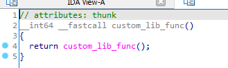
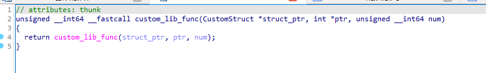
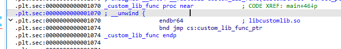
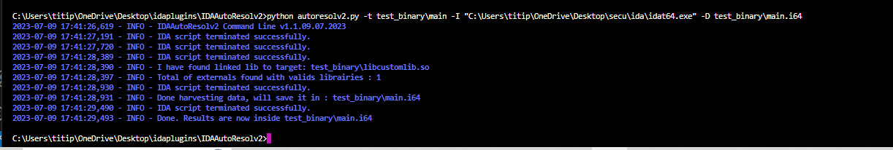

## AutoResolv2 : IDA Plugin

__AutoResolv2__ is a IDA framework (CC-NC License), which resolves functions imported from external libraries. It is version2 of AutoResolv, an older plugin doing that job.  

You meet a jump to an external function and you have no clue where this function is implemented?  
You want to know what parameters are actually used in the signature of the external function?  

Then AutoResolv2 can be useful.

AutoResolv2 will find the externals libraries linked to the binary, then will use IDAT tool to open and parse informations of the externals functions.
That include : 
    - return type of the function
    - Parameters / Call type of the function
    - AutoImport if existing structure type used in parameters.
    - AutoRefactor Xref using call type information of external functions.

Following binary size and the numbers of external functions, the program can take some time.  

# Demo

Before you run AutoResolv : 



After :

 

You can find a exemple in test_binary : 



# TEST & SUPPORT

- This project has been tested on :  
    - Windows : **OK**  
    - Linux : **UNKNOW**
    - Mac OS X : **NOT SUPPORTED**

- Support : 
    - Elf x64 : **OK**  
    - i386 : **Unknow**  
    - MIPS/POWERPC/ARM32/ARM64 : **UNKNOW**

Feel free to test it on those platforms and create a bug report if there is problems

# Requirements 

- acess to the library
- IDA Pro > 7.0
- IDAPython3
- lief
- hexrays decompiler


# Usage

```bash
Exemple 1 : python3 autoresolv2.py -t [your binary/your ida64 database] 
Exemple 2 : python autoresolv2.py -t test_binary\main -I "C:\Users\titip\OneDrive\Desktop\secu\ida\idat64.exe" -v -D test_binary\main.i64
```


Optionnal arguments : 
    -v --> verbose  
    -V --> Version  
    -S --> specify a custom dir of used libraries (Not yet added)  
    -I --> Specify idat location  
    -D --> specify a ida64 DB that will hold saved data. 


# BUG

when idat64 never run, it will ask some information to user or display some data than can block the script. 
If this happens, run idat64 at least one time to configure it. 